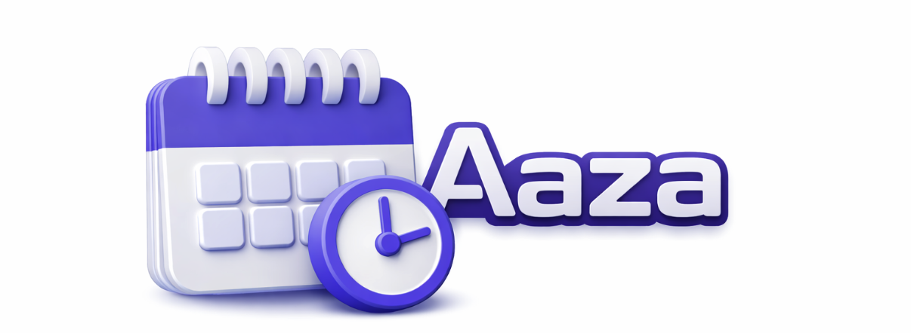

<h1 align="center">aaza (आज)</h1>

<p align="center">A minimal macOS menu bar app for Bikram Sambat (Nepali) date.</p>

<p align="center">
  
</p>

<p align="center">
  <a href="https://github.com/pray3m/aaza/releases"></a>
  
  
  
</p>

<p align="center"><code>aaza</code> keeps today’s Nepali date visible in your macOS menu bar with a native, lightweight UI.</p>

<h2 align="center">Screenshot</h2>

<p align="center">
  
</p>

## Features

- Always-visible BS date in the menu bar.
- Built with `SwiftUI` + `MenuBarExtra`.
- Kathmandu timezone aware (`Asia/Kathmandu`).
- Midnight rollover refresh for date changes.

## Installation

### Option 1: Homebrew (Recommended)

Install and stay up-to-date with Homebrew:

```bash
brew tap pray3m/tap
brew install --cask aaza
```

### Option 2: Manual Download

1. Download the latest `aaza-v*-macOS.zip` from [Releases](https://github.com/pray3m/aaza/releases).
2. Unzip to get `aaza.app`.
3. Move `aaza.app` to `/Applications`.
4. Open `aaza.app`.

> Note: Since this app is independently distributed, macOS may show a security prompt on first launch.
> If needed, right-click `aaza.app` and select **Open** once.

## Run Locally

1. Open `aaza.xcodeproj` in Xcode.
2. Select target `aaza` and run.
3. The date appears in your menu bar.

## Release

Public release/signing/notarization workflow is documented in [`RELEASE.md`](RELEASE.md).

## Roadmap

- [ ] Launch at Login.
- [ ] Devanagari/English numeral toggle.
- [ ] Quick copy to clipboard.
- [ ] Optional quick link to full monthly calendars.

## License

[MIT](LICENSE)

## Contributing

PRs are welcome. See [CONTRIBUTING.md](CONTRIBUTING.md).
